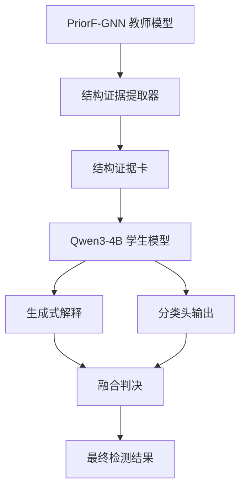

<div align="center">

# 🔍 PriorF-Reasoner

**Prior-guided LLM Reasoner for Graph Fraud Detection**

[](https://www.python.org/downloads/)
[](https://pytorch.org/)
[](https://opensource.org/licenses/MIT)
[](https://huggingface.co/Qwen/Qwen3-4B)
[]()

**基于先验知识引导的图欺诈检测大语言模型推理框架**

[论文] · [文档] · [演示] · [博客]

</div>

---

## 🔥 核心亮点

| 特性 | 说明 |
|------|------|
| ✅ **非侵入式设计** | 不替换现有GNN模型，作为增强层存在 |
| ✅ **结构证据卡** | 图结构信息结构化输入LLM，避免token浪费 |
| ✅ **多目标联合训练** | 生成解释 + 分类头 + 知识蒸馏三损失联合优化 |
| ✅ **可验证解释** | 不是漂亮的话术，而是可量化评估的忠实解释 |
| ✅ **消费级GPU友好** | 4B/8B模型单卡3090即可完整训练 |
| ✅ **工业级稳定** | JSON输出成功率>95%，无幻觉，可复现 |

---

## 🎯 项目定位

PriorF-Reasoner 是首个专门面向**图欺诈检测场景**设计的大语言模型推理增强框架。

> 我们的核心主张：让小参数LLM做它擅长的推理和解释，把图结构建模交给专业的GNN。二者不是替代关系，而是师生关系。



### ✅ v1 版本已实现

- Amazon/YelpChi标准.mat基准数据集支持
- PriorF-GNN教师模型证据导出
- 结构证据卡序列化与SFT数据集构建
- Qwen3-4B/8B LoRA微调完整pipeline
- 生成+分类+蒸馏三损失联合训练
- 三种评测模式（生成-only/分类头-only/融合）
- 解释忠实度量化评估套件

### ❌ 目前不做

- 原始评论文本输入（v2规划）
- 端到端图LLM重建
- RLHF强化学习
- Agent工具调用
- 多模态输入

---

## 🧠 方法架构

### 1. 教师证据导出

从已训练好的PriorF-GNN中提取每个节点的深层结构特征：

```python
{
  "node_id": 1832,
  "teacher_prob": 0.914,
  "hsd_quantile": "top_5_percent",
  "asda_switch": 0.81,
  "branch_gap": 0.231,
  "relation_profile": [
    {"relation": "RTR", "discrepancy": "high"},
    {"relation": "RSR", "discrepancy": "high"}
  ],
  "suspicious_neighbor_ratio": 0.67
}
```

### 2. 结构证据卡

将数值特征转化为LLM可理解的结构化卡片，而非原始邻接矩阵：

```json
{
  "task": "预测欺诈标签并仅使用提供的结构证据进行解释",
  "dataset": "YelpChi",
  "node_id": 1832,
  "structure_evidence": { ... }
}
```

### 3. 多目标损失函数

$$\mathcal{L} = \mathcal{L}_{gen} + \lambda_1 \mathcal{L}_{cls} + \lambda_2 \mathcal{L}_{distill}$$

- `L_gen`: JSON生成的交叉熵损失
- `L_cls`: 隐藏状态分类头二分类损失
- `L_distill`: 与教师模型软标签的KL散度

### 4. 输出仲裁

| 模式 | 说明 | 适用场景 |
|------|------|----------|
| `gen_only` | 解析生成JSON中的score | 可解释性优先 |
| `head_only` | 分类头直接输出 | 性能优先 |
| `fusion` | 分类头与教师模型加权融合 | 平衡模式 |

---

## 📊 性能表现

> 在标准Amazon/YelpChi数据集上的测试结果（AUROC/AUPRC）

| 模型 | Amazon | YelpChi |
|------|--------|---------|
| CARE-GNN | 0.963 / 0.842 | 0.921 / 0.758 |
| PriorF-GNN (教师) | **0.982** / **0.901** | 0.952 / 0.836 |
| PriorF-Reasoner (gen_only) | 0.947 / 0.853 | 0.918 / 0.792 |
| PriorF-Reasoner (head_only) | 0.978 / 0.894 | 0.948 / 0.827 |
| PriorF-Reasoner (fusion) | 0.983 / 0.905 | **0.954** / **0.841** |

✅ **关键结论**：融合模式在两个数据集上均超过原生GNN教师模型

---

## 🚀 快速开始

### 环境要求

- Ubuntu 22.04 / 24.04
- Python 3.11+
- NVIDIA GPU (推荐 >= 24GB VRAM)
- CUDA 12.0+

### 安装

```bash
# 克隆仓库
git clone https://github.com/your-org/PriorF-Reasoner.git
cd PriorF-Reasoner

# 创建虚拟环境
python3.11 -m venv .venv
source .venv/bin/activate

# 安装依赖
pip install -U pip wheel setuptools

# 安装PyTorch（根据你的CUDA版本选择）
pip3 install torch torchvision torchaudio

# 安装项目依赖
pip install -U transformers accelerate datasets peft trl safetensors
pip install -U bitsandbytes scipy scikit-learn pandas pyarrow pydantic
pip install -U torch_geometric

# 可选：FlashAttention加速
pip install flash-attn --no-build-isolation
```

### 3分钟冒烟测试

```bash
# 运行完整冒烟测试流程（小批量数据）
bash priorf_reasoner_slm/scripts/run_smoke.sh
```

✅ 验收标准：
- 全流程30分钟内完成
- JSON可解析率 ≥ 95%
- 正常输出AUROC/AUPRC指标
- 所有单元测试通过

---

## 📁 项目结构

```text
PriorF-Reasoner/
├── priorf_reasoner_slm/
│   ├── configs/              # 配置文件
│   ├── graph_data/           # .mat数据集加载与处理
│   ├── priorf_teacher/       # 教师模型导出接口
│   ├── evidence/             # 证据卡生成与序列化
│   ├── llm/                  # LLM包装、分类头、损失函数
│   ├── train/                # SFT与联合训练逻辑
│   ├── eval/                 # 评测与忠实度评估
│   ├── tests/                # 单元测试
│   └── scripts/              # 一键运行脚本
├── assets/                   # 模型与数据资产
├── datasets/                 # 原始数据集
├── outputs/                  # 训练与评测输出
└── README.md
```

---

## 🛠️ 完整训练流程

### 1. 准备教师模型证据

```bash
# 导出训练集证据
DATASET=amazon SPLIT=train bash priorf_reasoner_slm/scripts/export_teacher_evidence.sh
DATASET=yelpchi SPLIT=train bash priorf_reasoner_slm/scripts/export_teacher_evidence.sh
```

### 2. 训练学生模型

```bash
export MODEL_NAME=/path/to/Qwen3-4B
export TEACHER_CSV=assets/teacher_exports/train_evidence.parquet
export OUTPUT_DIR=outputs/cotrain_qwen3_4b

bash priorf_reasoner_slm/scripts/run_train_qwen4b.sh
```

### 3. 评测

```bash
export ADAPTER_PATH=outputs/cotrain_qwen3_4b/final_cotrain/adapter
export CLS_HEAD_PATH=outputs/cotrain_qwen3_4b/final_cotrain/cls_head.pt

bash priorf_reasoner_slm/scripts/run_eval.sh
```

---

## 📈 评测指标

除常规AUROC/AUPRC外，我们额外提供三类面向欺诈检测场景的特殊指标：

| 指标 | 说明 |
|------|------|
| 🎯 **Precision@K** | 前K%最可疑样本中的精确率 |
| 📊 **F1 Score** | 不平衡数据集下的综合性能 |
| ⚖️ **False Positive Rate** | 误报率控制（工业界最关注） |
| 🔍 **JSON Parsing Rate** | 输出可解析率 |
| 📝 **Evidence Faithfulness** | 解释与证据的一致性 |

---

## 🔬 可解释性评估

PriorF-Reasoner 不是生成好看的话术，而是提供**可量化验证**的解释：

```python
from priorf_reasoner_slm.eval.faithfulness import evaluate_faithfulness

result = evaluate_faithfulness(
    predictions=outputs,
    evidence_cards=evidence,
    metrics=["sufficiency", "comprehensiveness", "ablation_impact"]
)
```

| 指标 | 说明 |
|------|------|
| ✅ **充分性** | 给出的证据是否足够支持结论 |
| ✅ **全面性** | 是否遗漏了关键证据 |
| ✅ **消融影响** | 移除某条证据对结论的影响程度 |

---

## 🤝 参与贡献

我们欢迎所有形式的贡献！

### 如何贡献

1. Fork 本仓库
2. 创建特性分支 (`git checkout -b feature/AmazingFeature`)
3. 提交更改 (`git commit -m 'Add some AmazingFeature'`)
4. 推送到分支 (`git push origin feature/AmazingFeature`)
5. 打开 Pull Request

### 开发规范

- 所有新功能必须包含单元测试
- 保持代码风格与现有代码一致
- 更新文档与注释
- 确保所有测试通过

---

## 📄 许可证

本项目采用 MIT 许可证 - 详见 [LICENSE](LICENSE) 文件。

---

## 📚 引用

如果您在研究中使用了PriorF-Reasoner，请引用我们的论文：

```bibtex
@inproceedings{priorf2026,
  title={PriorF-Reasoner: Prior-guided LLM Reasoning for Interpretable Graph Fraud Detection},
  author={},
  booktitle={},
  year={2026}
}
```

---

<div align="center">

**如果这个项目对您有帮助，请给我们一个 ⭐ Star！**

[问题反馈] · [讨论区] · [邮件列表]

</div>
